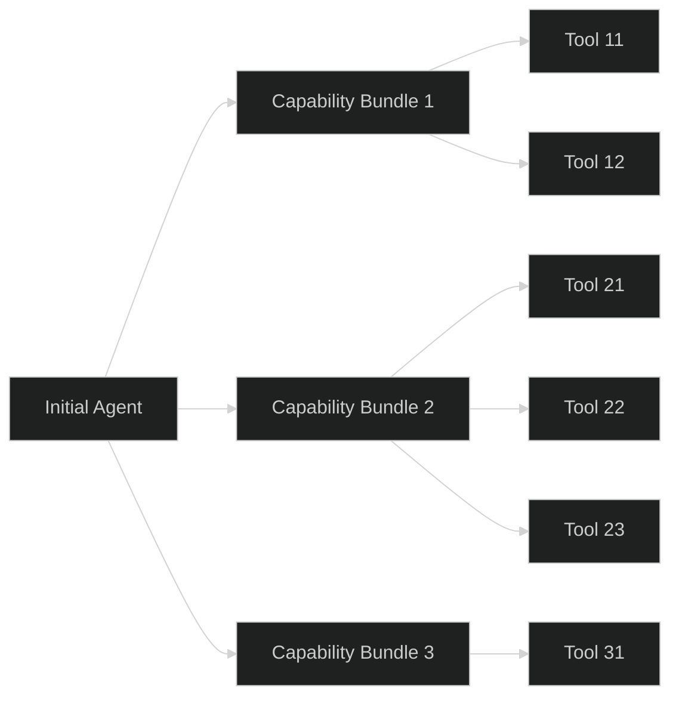
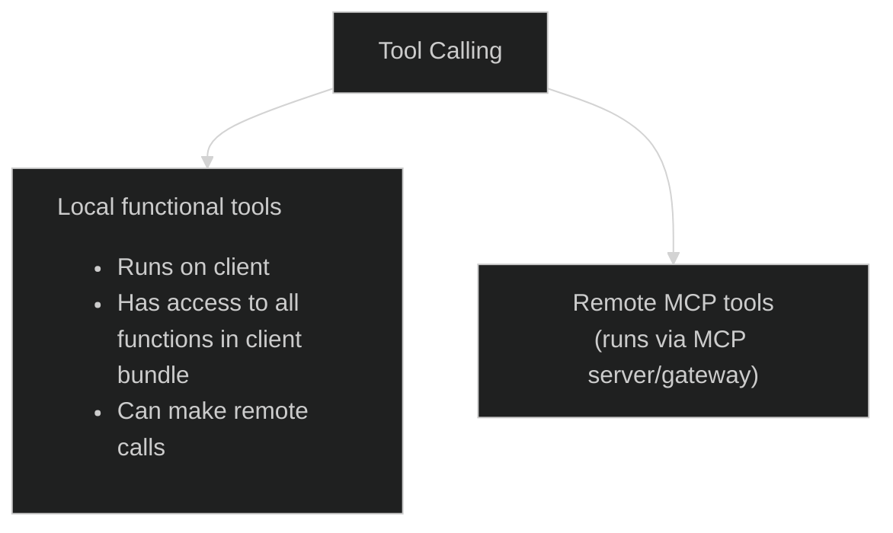

# Features

## Table of Contents

- [Ultra Low Latency](#ultra-low-latency)
- [Multi-Modal](#multi-modal)
- [Multi-Agent](#multi-agent)
- [Dynamic UI Rendering with json-render](#dynamic-ui-rendering-with-json-render)
- [Tool Calling](#tool-calling)
- [Agent Context](#agent-context)
- [Dynamic Instruction Templating](#dynamic-instruction-templating)
- [Realtime Events Panel for Debugging](#realtime-events-panel-for-debugging)

## Ultra Low Latency

- Uses low latency WebRTC (**UDP based**) multi-modal connection.
- Securely connects directly to model provider (e.g. OAI) without going through our backend servers.
  - An ephemeral token issued from our backend just for establishing the connection to model provider
  - After this initial handshake, our servers are out of picture (except of course **some** tool calls)
- Agents are effectively "hosted" on the client runtime (browser/app), so turn-taking, state updates, and tool selection happen close to the user instead of on a relay backend.
- This direct client <-> model-provider low latency path avoids an extra server hop and avoids running duplicate orchestration loops on your own servers for every turn.
- Cost can be lower in practice because you typically pay mainly for model tokens + selective tool calls, instead of model tokens **plus** always-on backend compute/network for proxying realtime traffic.
- Using official Realtime rates, rough audio-only baseline is small: ~600 input audio tokens/min (1 token/100ms) and ~1200 output audio tokens/min (1 token/50ms), which is about `$0.00324/min` on `gpt-realtime-mini` and `$0.0216/min` on `gpt-realtime` before extra text/tool/transcription usage.
- For workloads that do not need a heavier frontier model on every turn, `gpt-realtime-mini` + tools can be a strong price/performance setup compared with a backend-mediated architecture that also invokes frontier reasoning models each turn.
  - References: [OpenAI API Pricing](https://openai.com/api/pricing/) and [Realtime Cost Guide](https://developers.openai.com/api/docs/guides/realtime-costs/)
- Architecture is flexible enough to run both realtime and non realtime model. But this repo only focuses on realtime.

## Multi-Modal

- Supports voice-first realtime interactions through the realtime session transport.
- Allows text, audio and image messages to be sent into the same live session for hybrid input experiences.
- Uses an audio element in the UI to stream and play model audio responses in real time.

## Multi-Agent

- Realtime agents are defined in [`/agents`](/agents/) and configured as reusable modules.
- Agent behavior is declared with structured properties like `name`, `voice`, `instructions`, and `tools`.
- This architecture allows us to have a scalable hierarchy to handle context overflow and tool selection accuracy without giving up simplicity.
  - Think of it as a similar abstraction as [skills](https://platform.claude.com/docs/en/agents-and-tools/agent-skills/overview) or Tool-Sets i.e. a way to group related tools.
- This repo prefers multi-agent orchestration via LLM, but does not restrict orchestration via code. [[Read More](https://openai.github.io/openai-agents-js/guides/multi-agent/#orchestrating-via-llm)]

## Dynamic UI Rendering with json-render

- Uses [json-render](https://github.com/vercel-labs/json-render) to render UI from declarative JSON specs.
- Enables agents to drive rich interfaces without manual component wiring per view.
- Keeps rendering generic and composable through a shared registry and renderer provider pattern.

## Tool Calling

- Tool calls allow the assistant to fetch external data and return grounded responses.
- This is where it gets insanely powerful. This architecture showcases two types of tool calling
  - **Local functional tools**:
    1. Executes on client
    2. Can interact with any existing functionality in your client bundle
    3. Can make remote requests if needed.
    4. e.g. add to cart on an e-comm app.
  - **Remote MCP tools**. Extremely useful if:
    1. You already have a MCP server for the use case
    2. You have an org wide MCP Gateway for tool-search-tool or governance.

## Agent Context

- Flexible, strongly typed context can be passed when creating realtime sessions
- Context values are available during agent runs and instruction building.
- This enables context-aware behavior including and beyond user-specific personalization.

## Dynamic Instruction Templating

- Agent instructions are built dynamically instead of being fully static text.
- A shared instruction template can include placeholders resolved at runtime.
- Placeholders can map to any available session context values, not just user fields.

## Realtime Events Panel for Debugging

- Includes a dedicated realtime events panel in the experience UI.
- Designed to surface transport/session activity for easier debugging and observability.
- Helps inspect realtime behavior while developing and tuning agent experiences.
