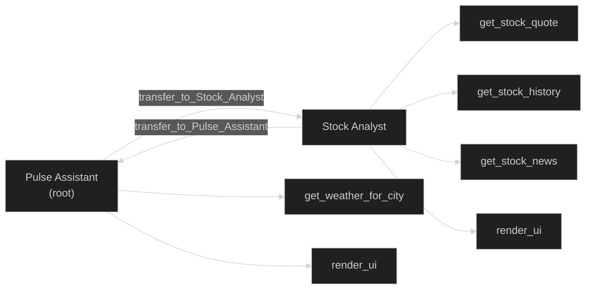
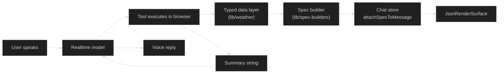
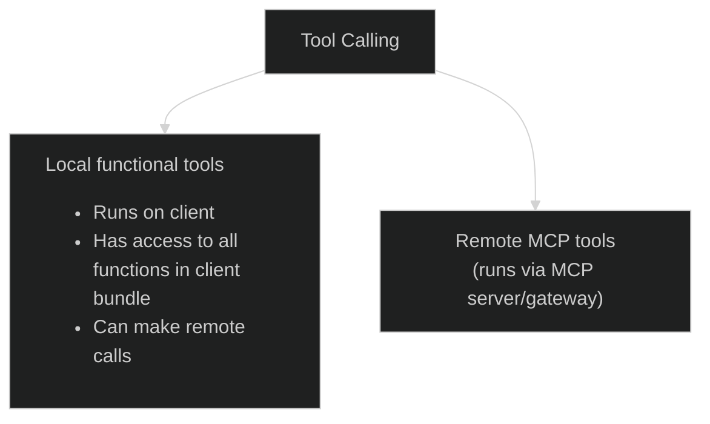

# Features

## Table of Contents

- [Ultra Low Latency](#ultra-low-latency)
- [Multi-Modal](#multi-modal)
- [Multi-Agent](#multi-agent)
- [Dynamic UI Rendering with json-render](#dynamic-ui-rendering-with-json-render)
- [Generative UI from Tools](#generative-ui-from-tools)
- [Tool Calling](#tool-calling)
- [Agent Context](#agent-context)
- [Dynamic Instruction Templating](#dynamic-instruction-templating)
- [Realtime Events Panel for Debugging](#realtime-events-panel-for-debugging)

## Ultra Low Latency

- Uses low latency WebRTC (**UDP based**) multi-modal connection.
- Securely connects directly to model provider (e.g. OAI) without going through our backend servers.
  - An ephemeral token issued from our backend just for establishing the connection to model provider
  - After this initial handshake, our servers are out of picture (except of course **some** tool calls)
- Agents are effectively "hosted" on the client runtime (browser/app), so turn-taking, state updates, and tool selection happen close to the user instead of on a relay backend.
- This direct client <-> model-provider low latency path avoids an extra server hop and avoids running duplicate orchestration loops on your own servers for every turn.
- Cost can be lower in practice because you typically pay mainly for model tokens + selective tool calls, instead of model tokens **plus** always-on backend compute/network for proxying realtime traffic.
- Using official Realtime rates, rough audio-only baseline is small: ~600 input audio tokens/min (1 token/100ms) and ~1200 output audio tokens/min (1 token/50ms), which is about `$0.00324/min` on `gpt-realtime-mini` and `$0.0216/min` on `gpt-realtime` before extra text/tool/transcription usage.
- For workloads that do not need a heavier frontier model on every turn, `gpt-realtime-mini` + tools can be a strong price/performance setup compared with a backend-mediated architecture that also invokes frontier reasoning models each turn.
  - References: [OpenAI API Pricing](https://openai.com/api/pricing/) and [Realtime Cost Guide](https://developers.openai.com/api/docs/guides/realtime-costs/)
- Architecture is flexible enough to run both realtime and non realtime model. But this repo only focuses on realtime.

## Multi-Modal

- Voice-first over the realtime transport, or **text-only**: connecting with text supplies a silent input and asks for text output, so it runs with no microphone and no speech.
- Allows text, audio and image messages to be sent into the same live session for hybrid input experiences.
- Uses an audio element in the UI to stream and play model audio responses in real time.

## Multi-Agent

- Realtime agents live in [`/agents`](/agents/) as reusable modules: a `name`, a `voice`, a
  `handoffDescription`, an instruction builder and a tool set from [`/tools`](/tools/).
- A session starts on the **root agent** (`Pulse Assistant`) and hands off to **specialists**, each
  a bundle of related tools with its own prompt — the same idea as
  [skills](https://platform.claude.com/docs/en/agents-and-tools/agent-skills/overview) or tool-sets.
  A realtime session only carries the _current_ agent's tools and instructions, so a handoff is also
  a budget boundary: the root never pays connect latency for a specialist's tools.
- Orchestration is by the LLM through SDK handoffs
  ([read more](https://openai.github.io/openai-agents-js/guides/multi-agent/#orchestrating-via-llm)).
  What keeps it modular (details in [`agents/README.md`](/agents/README.md)):
  - **A registry, not a tree of imports.** `agents/index.ts` gives the root `handoffs:
specialistAgents` and every specialist a handoff back to the root, assigned after construction
    so no module imports another agent.
  - **Prompts decoupled by `handoffDescription`.** The SDK generates one `transfer_to_<name>` tool
    per handoff from the target's description, so no prompt names another agent. Adding a
    specialist is one registry entry and zero edits elsewhere.
  - **One voice.** A realtime session cannot change voice once an agent has spoken, so every agent
    uses the shared `AGENT_VOICE`.

```mermaid
%%{init: {'theme': 'dark'}}%%
flowchart LR
    R["Pulse Assistant<br/>(root)"]
    S["Stock Analyst"]
    W["get_weather_for_city"]
    U1["render_ui"]
    Q["get_stock_quote"]
    H["get_stock_history"]
    N["get_stock_news"]
    U2["render_ui"]

    R -- "transfer_to_Stock_Analyst" --> S
    S -- "transfer_to_Pulse_Assistant" --> R

    R --> W
    R --> U1
    S --> Q
    S --> H
    S --> N
    S --> U2
```

**Worked example.** Ask "how is Apple doing?" and the root agent, which knows nothing about
stocks, hands over silently because a transfer tool's description matches. The Stock Analyst
(`agents/stockAnalyst.ts`) calls `get_stock_quote` — it is told never to quote a number from memory
— which fetches a typed `TStockReport` through the `actions/getStockReports.ts` server action,
attaches the quote card built by `lib/spec-builders/stockQuote.ts`, and returns the sentences in
`lib/stocks/summary.ts`: price and today's move, position in the 52-week range, P/E and dividend
yield, analyst consensus in words, and the period trend, with unavailable figures declared rather
than guessed. Asked "should I buy it?", it reasons out loud from exactly those figures, gives a
clear leaning, and says it is not financial advice. When the subject changes it hands back.

## Dynamic UI Rendering with json-render

- Uses [json-render](https://github.com/vercel-labs/json-render) to render UI from declarative JSON specs.
- Enables agents to drive rich interfaces without manual component wiring per view.
- Keeps rendering generic and composable through a shared registry and renderer provider pattern.
- A vocabulary of domain-neutral blocks (definitions in `lib/json-render/blocks/`, components in
  `components/json-render/blocks/`; `/showcase` renders every one and shows the live count) covers
  layout, text, metrics, charts, narrative notes, media and interaction — 25 blocks in six
  families. Domain UI
  is a _composition_ of those blocks, never a new component: the weather card is built entirely from
  `CardBlock`, `HeadingBlock`, `MetricBlock`, `GridBlock`, `CarouselBlock` and friends.
- `lib/json-render/catalog.ts` is the React-free contract shared with the model — `validate()` and
  the block vocabulary are importable from tool code without dragging the component tree along.

## Generative UI from Tools

The assistant answers with a screen as well as a voice. Two paths lead there, and the split is
deliberate.

**Typed experiences — the primary path.** A tool fetches its data, builds a spec with the typed
builders in `lib/spec-builders/`, attaches it to the reply and returns a one-sentence summary for
the model to speak. The model chooses _which_ experience by choosing a tool; the layout itself is
written in TypeScript and prop-checked against each block's Zod schema at compile time.

For a realtime **voice** agent this is the right trade:

- **Instant.** The card is complete the moment the tool resolves, rather than streaming in token by token behind the speech.
- **Always valid.** A spec that compiles cannot violate the catalog schema.
- **Unhallucinable.** The model cannot invent a broken layout mid-sentence.

**`render_ui` — the escape hatch.** For open-ended requests the typed builders do not cover, the
agent emits its own spec as tool arguments. Before anything is rendered it passes three checks —
`jsonRenderCatalog.validate()` for the element envelope, each block's own Zod props schema for its
`props`, and the `blockActions` vocabulary for every `on` binding — so a bad spec comes back to the
model as `key.path: message` lines describing what was wrong rather than reaching the screen. This is what makes the block registry genuinely usable _by_ agents,
rather than only usable by the app on their behalf.

**Speech and screen say different things.** Every tool returns prose for the ear and a spec for the
eye. A voice assistant that reads a table out loud is worse than one that never drew it, so the
returned summary carries the headline and an explicit instruction not to narrate the card.

**The screen is an input surface too.** Blocks bind catalog actions (`suggest`, `select`) on the
element and `JsonRenderSurface` forwards every fired action to `onAction`. Tapping a follow-up chip
is a full round trip: `components/Chat/specActions.ts` sends the chip's text into the live session
as a user turn via `useSession`'s `sendMessage`, and — only once that send has succeeded — echoes it
into the transcript as a user bubble, because an injected conversation item is deliberately not
rendered by the message extractor and the reply would otherwise appear with nothing prompting it.
The handler is built in `RealtimeExperience` so it can reach the session, and is dropped while
disconnected, which makes the chips inert rather than letting them fire into a closed session.
`select` is a documented no-op: the catalog declares it, but no shipped block binds it and there is
no form state for a choice to land in.

```mermaid
%%{init: {'theme': 'dark'}}%%
flowchart LR
    U["User speaks"] --> M["Realtime model"]
    M --> T["Tool executes in browser"]
    T --> D["Typed data layer<br/>(lib/weather)"]
    D --> B["Spec builder<br/>(lib/spec-builders)"]
    B --> C["Chat store<br/>attachSpecToMessage"]
    C --> R["JsonRenderSurface"]
    T --> S["Summary string"]
    S --> M
    M --> V["Voice reply"]
```

## Tool Calling

- Tool calls let the assistant fetch external data and ground its answers. This architecture
  showcases two types of tool calling
  - **Local functional tools**:
    1. Executes on client
    2. Can interact with any existing functionality in your client bundle
    3. Can make remote requests if needed.
    4. e.g. add to cart on an e-comm app.
  - **Remote MCP tools**. Extremely useful if:
    1. You already have a MCP server for the use case
    2. You have an org wide MCP Gateway for tool-search-tool or governance.
- The shipped tools and the public APIs behind them (details in [`tools/README.md`](/tools/README.md)):
  - `get_weather_for_city` — [Open-Meteo](https://open-meteo.com), keyless, fetched from the browser.
  - `get_stock_quote`, `get_stock_history`, `get_stock_news` — two APIs behind one provider in
    `lib/stocks/`: **Yahoo Finance** chart and search endpoints (keyless: price, today's move, day
    and 52-week ranges, daily closes, "apple" → `AAPL`) and **Finnhub** (optional
    `FINNHUB_API_KEY`: market cap, P/E, EPS, dividend yield, analyst ratings, headlines). Finnhub
    calls can never fail the report; without a key those fields are simply unavailable. Both need
    headers a page cannot send, so the tools go through one server action,
    `actions/getStockReports.ts`, and build the cards client-side from its typed report.

```mermaid
%%{init: {'theme': 'dark'}}%%
flowchart TB
    TC["Tool Calling"] --> LF["<p style='text-align:left'>Local functional tools<br/><ul style='text-align:left'><li>Runs on client</li><li>Has access to all functions in client bundle<li>Can make remote calls</li></ul></p>"]
    TC --> RM["Remote MCP tools<br/>(runs via MCP server/gateway)"]
```

## Agent Context

- Flexible, strongly typed context can be passed when creating realtime sessions
- Context values are available during agent runs and instruction building.
- This enables context-aware behavior including and beyond user-specific personalization.

## Dynamic Instruction Templating

- Agent instructions are built dynamically instead of being fully static text.
- A shared instruction template can include placeholders resolved at runtime.
- Placeholders can map to any available session context values, not just user fields.

## Realtime Events Panel for Debugging

- A dedicated realtime events panel surfaces transport/session activity for debugging and observability.
- Helps inspect realtime behavior while developing and tuning agent experiences.
